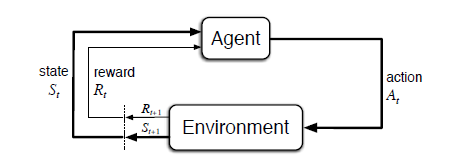

### 第三章

### 有限马尔科夫决策过程

​        在本章中，我们将介绍我们在本书其余部分中尝试解决的问题。这个问题可以被认为定义强化学习的领域：任何适合于解决这个问题的方法，我们认为是强化学习方法。

​        在这章我们的目标是在广义上来描述强化学习。我们试图传达可能被用作强化学习任务的各种可能的应用程序。我们还描述了可以进行精确的理论陈述的强化学习问题的理想化数学形式。我们介绍该问题的数学结构的关键部分，例如价值函数和贝尔曼方程。在所有的人工智能中，在适用性的宽度和数学易处理性之间存在矛盾（a tension）。在本章中，我们将介绍这种矛盾，并讨论一些它所带来的权衡和挑战。

####         3.1智能体环境接口

​        强化学习问题意味着从交互学习到实现目标的问题的直接框架。智能体在其中进行学习和决策。除了智能体本身，智能体与之交互的一切，称之为环境。它们不断地交互，智能体选择动作同时环境响应那些动作并向智能体呈现新的情况[^1，智能体试图随着时间最大化环境所反馈的奖励数值。一个完整规范的环境，包括如何确定奖励，定义一个强化学习问题的实例作为任务。

---

​                                     

######                                                                                                                                                      图3.1：强化学习中智能体与环境交互图 

​         具体来说，智能体和环境在离散时间序列每一步相互作用，t = 0,1,2,3,....[^2] 在每一步t，智能体感应到环境状态，$S_{t}\in \mathcal{S}$,$ \mathcal{S}$是所有可能状态的集合，并在此基础上选择动作，$A_{t} \in\mathcal{A}(S_{t}) $  ，$\mathcal{A}(S_{t})$是在状态$S_{t}$上所有动作的集合。每一步后，作为它行动的结果，智能体接收到一个奖励值，$R_{t+1} \in \mathcal{R} \subset  \mathbb{R}$，并且自身处于一个新状态，$S_{t+1}$ [^3] ，图3.1展示了智能体- 环境交互过程。

​        在每一步，智能体实现从状态到选择每个可能动作的概率的映射。 此映射称为智能体的策略，并表示为$\pi _{t}$，当$S_{t} =s$时，$A_{t}=a$的概率是$\pi _{t}(a|s)$，强化学习方法指定智能体根据经验改变其策略的方式。智能体的目标，大致来说，是最大化的获得它的长期总收益。

​      这个框架是灵活而抽象的，可以以不同的方式应用在很多不同的问题上。例如，时间步长不需要参考实时的固定间隔；它们可以指任意连续的决策和行动阶段。动作可以是低级控制，例如施加到机器人臂的电机的电压，或者高级决策，例如是否吃午饭或去研究生院。类似地，状态也可以采取各种各样的形式。它们可以完全由低级感应（例如直接传感器读数）来确定，或者它们可以是更高级的和抽象的，例如房间里的物体符号表示。可以基于对过去的感觉的记忆，甚至是完全精神的或主观的来构成一个状态。例如，智能体可能处于不能确定物体在哪里，或者在某种明确定义的意义上感到惊讶。类似地，一些动作可以是完全精神的或可计算的。例如，某些操作可能会控制智能体选择思考的内容，或者注意力集中在哪里。一般来说，动作可以是我们想要学习如何做的任何决定，而状态可以是任何我们可以知道，可能有用的。

---

​       特别的，智能体和环境之间的边界通常不像机器人或动物身体的物理边界。通常，边界更接近于智能体。例如，机器人及其感测硬件的电动机和机械联动件通常应被认为是环境的部分而不是智能体的部分。同样，如果我们将框架应用于人或动物，肌肉，骨骼和感觉器官应被视为环境的一部分。奖励也可以在自然和人工学习系统的物理体内计算，但被认为是智能体外部的。

​      我们遵循的一般规则是，任何不能由智能体任意改变的东西被认为是在它之外，因此是它的环境的一部分。我们不假定智能体对环境一无所知。例如，智能体一直知道如何用它的动作和它所在的状态的函数来计算奖励。但是我们总是认为奖励计算是在智能体之外的，因为它是根据智能体的任务所定义的，因此不能由智能体来随意改变。事实上，在一些情况下，智能体就算知道它的环境是如何运行的，但是所面临增强学习任务仍然很困难的，正如我们可以知道一个魔方是如何运行的，但仍然无法解开它。智能体-环境的边界代表着对智能体的绝对控制能力的限制，而不是限制它的知识。

​      智能体-环境的边界可以根据需要设置在不同的地方。在复杂的机器人中，许多不同的智能体可以一次操作，每个具有其自己的边界。例如，一个智能体可以做出高级决策，高级决策可由低级智能体面临的状态组成，从而实现高层次的决策。在实践中，一旦已经选择了特定状态，动作和奖励，就确定智能体 - 环境边界，并且因此已经识别感兴趣的特定决策任务。

​       强化学习框架大部分是从相互作用的目标导向学习的问题中抽象出来的。它提出，无论传感，记忆和控制装置的细节以及任何目标尝试实现的目标，学习目标指向行为的任何问题可以减少到在智能体与其环境之间来回传递的三个信号中：一个信号表示智能体做出的选择（动作），一个信号表示做出选择的基础（状态），以及另一个信号来定义智能体的目标（奖励）。这个框架可能不足以有效地代表所有的决策学习问题，但它已被证明是广泛有用和适用的。

​        当然，特定的状态和动作因任务而异，并且它们如何被表示可以极大地影响性能。在强化学习中，和其他类型的学习一样，这种表示的选择目前相比科学更多可说是艺术。在本书中，我们提供了一些关于状态和动作的表示建议和示例的好方法，但我们的主要焦点是一旦表示被确定，如何学习行为的一般原则。

​        **例3.1：生物反应器** 假设强化学习用于确定生物反应器（用于生产有用化学品的大量营养物和细菌）的力矩温度和搅拌速率。

---

这种应用中的动作可以是传递到下级控制系统的目标温度和目标搅拌速率，其进而直接激活加热元件和马达以实现目标。状态可能是有可能被过滤和延迟热电偶和其他感觉读数，加上代表大桶和目标化学品中的成分的符号输入。奖励可以是逐时测量由生物反应器产生有用化学品的速率。注意，这里每个状态是传感器读数和符号输入的列表或向量，并且每个动作是由目标温度和搅拌速率组成的向量。强化学习任务通常具有具有这种结构化表示的状态和动作。 另一方面，奖励总是单数。

​       **例3.2：拾取和放置机器人**考虑使用强化学习来控制机器人手臂在重复性拾取和放置任务中的运动。如果我们想要学习快速且平滑的运动，则当前智能体将必须直接控制马达并且具有关于机械联动装置的当前位置和速度的低延迟信息。在这种情况下的动作可以是施加到每个接头处的每个电动机的电压，而状态可以是关节角度和速度的最新读数。对于成功完成拾取和放置的每个目标，奖励可以是+1。为了鼓励平滑移动，在每个时间步长上，可以给出作为运动的瞬间“急动”的函数一个小的负的奖励。

​     **例3.3：环保机器人**移动机器人能在办公环境里进行收集空的汽水罐。它具有用于检测罐的传感器，以及可拾取并将它们放置在机载箱中的臂和夹具; 它依靠可充电电池运行。机器人的控制系统具有用于解释感觉信息，用于导航以及用于控制臂和夹具的部件。关于如何搜索罐的高级决定由强化学习智能体基于电池的当前电量进行判断。该智能体必须决定机器人是否应该（1）在一定时间内主动搜索罐，（2）保持静止，并等待某人给它罐，或者（3）回到其原始基地电池充电。这个决定必须定期或每当某些事件发生时做出，例如发现一个空罐。因此，这个智能体有三个动作，其状态由电池的状态决定。奖励在大多数时间可能为零，但是当机器人获得一个空罐时变为正，或者如果电池一直运行则是大的负值。在这个例子中，强化学习智能体不是整个机器人。它监视的状态描述机器人本身内在的条件，而不是机器人的外部环境的条件。 智能体的环境包括机器人的其余部分，其可能包含其他复杂的决策系统，以及机器人的外部环境。

​     **练习3.1**将你自己的三个示例任务设计到强化学习框架中，识别每个状态，动作和奖励。使这三个示例尽可能彼此不同。该框架是抽象灵活的，

---

可以以许多不同的方式应用。 至少在你的一个例子中以某种方式扩展它的极限。

​     **练习3.2 **强化学习框架是否足以有效地代表所有目标导向的学习任务？ 你能想到任何明显的例外吗？

​     **练习3.3** 考虑驾驶的问题。 你可以定义加速器，方向盘和制动器的动作，也就是说，你的身体接触到的机器。或者你可以把它们考虑更多一点 - 比如，再橡胶路上，考虑你的动作是轮胎扭矩。或者你可以考虑更多，例如，你的大脑掌控身体，动作是肌肉抽搐控制你的四肢。或者你可以去一个真正高的层次，你的动作是选择去那里开车。什么是智能体和环境之间合适的层次和位置分界？ 在什么基础上，该分界的一个位置是优先于另一个？ 有什么根本原因选择一个而不选择另一个，或者是随意的选择？

[^1]: 我们使用术语智能体，环境和动作，而不是工程师术语控制器，受控系统（或工厂）和控制信号，因为它们对更广泛的受众有意义。

[^2]: 我们将注意力限制在离散时间以使事情尽可能简单，即使许多想法可以延伸到连续时间情况（例如，参见Bertsekas和Tsitsiklis，1996; Werbos，1992; Doya，1996）。
[^3]: 我们使用$R_{t+1}$而不是$R_{t}$来表示归因于$A_{t}$的奖励，因为它强调下一个奖励和下一个状态$R_{t+1}$和 $S_{t+1}$共同确定。 不幸的是，这两种惯例在文献中都被广泛使用。

#### 3.2 目标和奖励

​      在强化学习中，智能体的目的或目标被形式化为从环境传递到智能体的特殊奖励信号。在每一步，奖励是一个简单的数字，$R_{t} \in   \mathbb{R}$。非正式地，智能体的目标是最大化它收到的总奖励。这意味着不是立即奖励的最大化，而是长期的累积奖励。 我们可以用奖励假说来清楚表达这个非正式的想法：

*我们通过目标和目的时意味着是接收到的标量信号（称为奖励）的累积和的期望值的最大化。*

使用奖励信号来形式化目标的想法是强化学习的最显着的特征之一。

​      尽管在奖励信号方面制定目标可能首先会出现限制，但在实践中它已被证明是可行的和广泛适用的。 看到这一点的最好方法是考虑它已经或可能被使用的例子。例如，为了让机器人学会走路，研究人员在与机器人的前进运动成比例的每个时间步长上提供了奖励。在使机器人学习如何从迷宫中逃脱时，对于在成功逃脱之前经过的每个时间步长，奖励通常为-1;这鼓励智能体尽快逃离。为了使机器人学会找到并收集空罐用于回收，可以在大多数时间给予它零回报，然后每收集一次空罐给+1的回报。人们可能也想给机器人负面的奖励，如在当它撞到东西或当有人叫它时候。对于一个学习玩棋的智能体，自然奖励是+1获胜，-1为失败，0用来表示所有非终止的位置。

​     你可以看到所有这些例子中发生了什么。 智能体总是学会最大化其奖励。如果我们希望它为我们做某事，我们必须提供奖励给它，最大化奖励这样智能体也将实现我们的目标。

---

 因此，我们建立的奖励真正表明我们想要完成的是至关重要的。特别地，奖励信号不是传授给智能体如何实现我们想要做的事情的先验知识。[^4] 例如，下棋玩家应该仅奖励实际获胜，而不是用于实现子目标，例如获取对手的棋子或获得棋盘中心的控制。如果实现这些子目标被奖励，那么智能体可能会找到一种方法来实现它们，而不实现真正的目标。 例如，它可能找到一种方式来赢得对手的棋子，即使付出输掉游戏的代价。 奖励信号是你与机器人沟通的方式，你想要它实现的，而不是你想要它如何实现的方式。

​       强化学习的新手有时惊讶这些，奖励 - 它是学习目标的定义 - 是在环境中而不是在智能体中计算的。当然，动物的最终目标通过在身体内发生的计算来识别，例如通过用于识别食物，饥饿，疼痛和快感的感觉。然而，正如我们在上一节中讨论的，可以重新确定智能体 - 环境接口，使得身体的这些部分被认为在智能体之外（并且因此是智能体的环境的一部分）。例如，如果目标涉及机器人的内部能量储存器，则这些被认为是环境的一部分;如果目标涉及机器人的肢体的位置，则这些也被认为是环境的一部分 - 也就是说，智能体的边界被确定在肢体及其控制系统之间的接口处。这些东西被认为是机器人内部的，但在学习智能体的外部。为了我们的目的，方便的办法不是将学习智能体的边界放置在其物理体的极限处，而是放在处于其控制的极限处。

​       我们这样做的原因是，智能体的最终目标应该是它不完全控制的东西：它也不应该能被控制，例如，简单地命令，奖励已被收到，以同样的方式，它可以任意改变其行为 。 因此，我们将奖励源放在智能体之外。 这并不排除智能体为自己定义一种内部奖励，或一系列内部奖励。 事实上，这正是许多强化学习方法所做的。

####        3.3 回归

到目前为止，我们已经讨论了非正式学习的目标。 我们已经说过，智能体的目标是获得从长远来看的最大累积奖励。 这如何正式定义？如果在时间步骤*t*之后接收的奖励序列表示为$R_{t + 1}$,$R_{t + 2}$, $R_{t + 3}$,……，那么我们希望最大化这个序列的具体什么地方？一般来说，我们寻求最大化预期回报，其中回报$G_{t}$被定义为回报序列的一些特定函数。

[^4]: 更好的方式是传授这种先验知识是最初的政策或价值功能，或对这些的影响。 参见Lin（1992），Maclin和Shavlik（1994）和Clouse（1996）。

---

在最简单的情况下，回报是奖励的总和：

$G_{t} \doteq R_{t+1} +R_{t+2} +R_{t+3}+...+R_{T},$

其中*T*是最后一步。这种方法在其中存在最终时间步长的自然概念的应用中是有意义的，也就是说，当智能体 - 环境交互自然地断裂成子序列，我们称之为*情节*[^5]，诸如玩游戏，通过迷宫的旅程， 或任何种类的重复交互。每个情节在称为终端状态的特殊状态结束，随后是重置到标准起始状态或从起始状态的标准分布的抽样。即使你认为情节以不同的方式结束，例如获胜和失败的游戏，下个情节也会独立于前情节的结束。因此，情节可以被认为在相同的终点状态中结束，对于不同的结果给予不同的奖励。这种类型的任务被称为*情景*任务。在情景任务中，我们有时需要区分所有非终结状态的集合，表示为$\mathcal{S}$，从所有状态的集合加上终端状态，表示为$\mathcal{S+}$。

​       另一方面，在许多情况下，智能体 - 环境交互不会自然地分开成可识别的情节，而是连续的无限制地发生着。例如，这将是一个自然的方式来制定一个持续的过程控制任务，或具有长寿命的机器人上的应用。我们称之为这些持续的任务。返回公式（3.1）对于连续的任务是有问题的，因为最终的时间步长将是T = 1，并且返回，这是我们试图最大化的，但其本身可以是无限的。（例如，假设智能体在每个时间步骤接收到+1的奖励。）因此，在本书中，我们通常使用返回的定义，它在概念上略微更复杂，但在数学上更简单。

​        我们需要的另一个概念是衰减因子。 根据该方法，智能体尝试选择动作，使得它在未来接收的衰减的奖励的总和被最大化。 特别地，它选择$A_{t}$以最大化得到预期衰减的回报：

$ G_{t} \doteq R_{t+1} +  \gamma R_{t+2} + \gamma ^ 2 R_{t+3}+...=  \sum_{k=0}^\infty \gamma^k R_{t+k+1}, $(3.2)

其中$\gamma$是参数，$0 \leq\gamma \leq 1$，称为*衰减因子*。

​         衰减率决定了未来奖励的现值：在将来接收的k时间步长的奖励是值得的，如果$\gamma ^{k-1}$的奖励是立即被接收的。如果$\gamma$<1，则无穷总和具有有限值，只要奖励序列{$R_{k}$}是有界的。如果$\gamma$ = 0，智能体是“近视”，只关心最大即时奖励：其目标是在这种情况下学习如何选择$A_{t}$以便最大化仅$R_{t+1}$。如果每个智能体的行为仅影响即时奖励，而不影响未来奖励，则近视智能体可以通过分别最大化每个即时奖励来最大化公式（3.2）。但一般来说，最大化立即报酬可以减少获得未来奖励的机会，从而实际上会减少回报。至于方法1，更加强烈地考虑未来的奖励目标：智能体变得更加有远见。

[^5]: 情节有时在文献中称为“试验”。  

---

######                                                                                                                                        图3.2：杆平衡任务。

​         示例3.4：杆平衡图3.2显示了一个作为强化学习的早期示例的任务。这里的目的是向沿着轨道移动的手推车施加力，以便保持铰接到手推车的杆不会掉落。故障是杆从垂直或在轨道的车运行时发生掉落。每次故障后，极点复位为垂直。 这个任务可以被当作情节，其中自然情节是反复尝试来平衡杆。在这种情况下的奖励是+1对于没有发生故障，使得每次的返回将是直到失败的步骤的数量。或者，我们可以将杆平衡作为持续的任务，使用衰减因子。在这种情况下，奖励将在每个故障为-1，在所有其他时间为零。每次的返回将$-\gamma^K$相关，其中K是失效之前的时间步数。 在任一情况下，通过保持杆平衡尽可能长的时间来得到最大化奖励。

​	练习3.4 假设你将杆平衡作为一个情节性任务，但是也使用了衰减因子，除了-1是失败之外，所有奖励都是零。 那么每次回报是多少？ 这个回报与有衰减的持续任务有什么不同？

​         练习3.5想象你正在设计一个走迷宫的机器人。 你决定给它一个+1的奖励，从迷宫逃脱，并在其他时间奖励零。这个任务似乎自然地被分解成情节——连续的穿过迷宫——所以你决定把它当作一个情节的任务，目标是最大化预期的总奖励（3.1）。 运行学习智能体一段时间后，你会发现从迷宫中逃脱没有达到预期效果。 出了什么问题？ 你有没有真正地向智能体传达你想要的指令？

#### 3.4 情节和持续任务的统一符号

​        在上一节中，我们描述了两种强化学习任务，一种是其中智能体—环境交互自然地分解成一系列单独的情节（情节性的任务），另一种则不会（持续任务））。前一种在数学上更容易计算，因为每个动作只影响随后在情节中收到的有限数量的奖励。在这本书中，我们有时考虑前一种问题，有时候会考虑另一种问题，但往往两者都需要考虑。因此，提出一个使我们能够同时精确地讨论这两种情况的符号是有用的。

---

​        为了准确的描述情节任务需要一些额外的符号。不再是一连串的时间步长，我们需要考虑一系列的情节，每一个情节都由一系列时间步长组成。我们从零开始重新开始编号每个情节的时间步长。因此，我们不仅要使用$S_{t}$表示在时间$t$的状态，而且需要使用$S_{t,i}$，在情节$i$的时间$t$的状态表示（$A_{t,i}$，$R_{t,i}$，$\pi_{t,i}$， $T_{i}$等符号意义相似）。然而，事实证明，当我们讨论情节任务时，我们几乎不必区分不同的情节。我们总是会考虑一个特定的情节，或者说出所有情节都是如此。因此，在实践中，我们总是通过省略情节的明确引用符号。 也就是说，我们将用$S_{t}$来指$S_{t,i}$，等等。

​        我们需要另外一个约定来定义一个涵盖情节和连续性任务的单一符号。在一例（3.1）中，我们将返回归结于有限数量的步数的总和，另一个是无限数量的总和（3.2）。这些可以通过考虑情节终止来进行统一，这是一个特殊的吸收状态的转换，只转换到自己，只产生零的奖励。 例如，考虑状态转换图

这里的实心方块表示与情节结束对应的特殊吸收状态。从$S_{0}$开始，我们得到奖励序列+1，+1，+1，0，0，0，......总结这些，我们得到相同的返回值，无论我们是否相加第一个*T*奖励（这里*T* = 3）或以上整个无限序列。即使我们引入折扣，这仍然是成立的。因此，我们可以根据（3.2）来定义回报，按照省略不必要情节编号的惯例，并且包括如果总和仍然被定义为$\gamma = 1$的可能性（例如，所有情节终止 ）。 或者，我们也可以写回报如下

$ G_{t} \doteq  \sum_{k=0}^{T-t-1} \gamma^k R_{t+k+1}, $                                                           (3.3)

包括$T = \infty$或$\gamma = 1$（不能同时存在）的可能性。我们在本书的其余部分中使用这些约定来简化符号，并表达情节和持续任务之间的接近相似。 （后来，在第10章中，我们将介绍一个持续不变的形式。）

---

#### *3.5马尔科夫属性

在强化学习框架中，智能体根据来自环境*状态*的信号作出决定。在本节中，我们将讨论什么是状态信号，什么样的信息是我们应该或不应该期望的。特别是，我们正式将一种特别感兴趣的环境属性和它的状态信号称为马尔可夫属性。

P74 para2  111