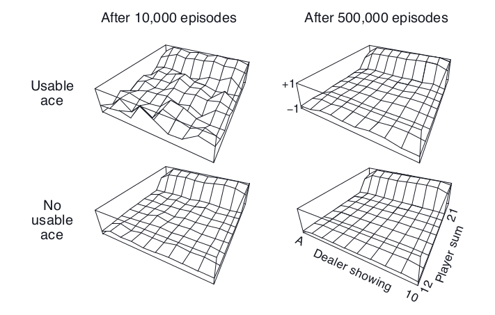
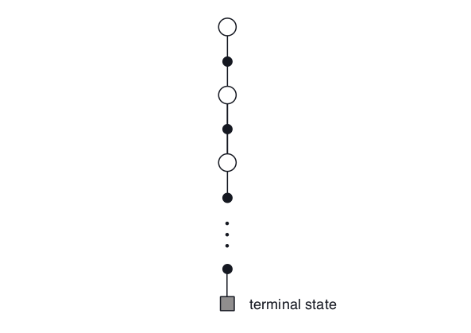
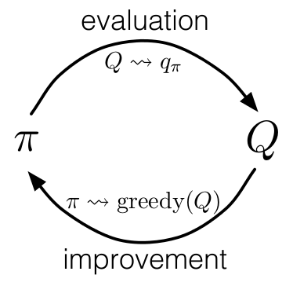

# 第五章  

# 蒙特卡洛方法

  这一章，我们开始考虑评估值函数以及获得最优策略的第一种学习方法。不同于上一章，这里我们不再假设我们对环境有完全的了解。蒙特卡洛方法(Monte Carlo methods)需要的仅仅是*经验(experience)*——与环境进行真实的或者模拟的交互所得到的状态，动作，奖励的样本序列。其中，从*真实*的经验学习是非常吸引人的，因为它在不需要关于环境动态的先验知识的情况下仍然能够获得最优的行为（策略）；而从*模拟*的经验学习也同样强大，虽然这时需要一个模型，但是这个模型仅仅用来产生样本，并不是动态规划(DP)方法中所用到的所有转移概率的完整分布函数。在相当多情况下我们很容易从目标的概率分布函数中进行抽样得到样本，可是很难获得这个分布的显式（具体）形式。[^译者注1]

​		

[^译者注1]: 这里是说，很多情况下我们不知道转移概率的具体分布，所以很难用动态规划的办法。但是我们很容易从与环境交互中获得抽样样本，可以用蒙特卡罗的办法。因为样本是直接从环境中获得的，等效于直接从真实的转移概率分布中抽样。

  蒙特卡罗方法是基于对样本回报(return)求平均的办法来解决强化学习的问题的。为了保证能够得到良好定义的回报，这里我们定义蒙特卡洛方法仅适用于回合制任务(eposodic tasks)。就是说，我们假设我们的经验(experience)被分成一个个的事件，而且对每个事件而言，不管选择什么样的动作，都会结束。只有在事件结束时，我们的价值估计和策略才会改变。蒙特卡洛方法因此能够写成逐个回合(episode)的增量形式。不过不能写成逐步（在线）的形式。术语“蒙特卡洛”被广泛的用于任何的在操作中引入了随机成分的估计方法。这里我们使用它来表示基于平均整个回报(return)的方法（区别于那些使用部分的回报(return)的方法。我们将在下一章阐述）。

  蒙特卡洛方法使用抽样以及对状态-动作对的*回报(return)*求平均的办法很像我们在第二章中遇到的赌博机中使用的方法，在第二章中我们也使用了抽样以及对每个动作的*奖励(reward)*求平均的方法。他们主要的区别在于，我们现在有多种状态，每个表现地就像一个不同的赌博机问题（就像一个联合-搜索或前后关联的赌博机），而且它们之间是相互关联的。就是说，在一个状态下做出一个动作的回报依赖于本事件中这个状态之后的状态所做的动作。因为所有动作的选择也正在学习中，从之前的表述来看，问题变成了非平稳(nonstationary)的。

  为了解决这种非平稳性(nonstationarity)，我们改变我们的办法，像我们在第四章中对动态规划方法(DP)所做的，使用广义策略迭代(general policy iteration, GPI)。那里我们依靠对MDP的了解来*计算(computed)*价值函数(value function)，这里呢我们从MDP的抽样回报中*学习(learn)*价值函数(value function)。我们使用相同的办法去获得最优的价值函数和策略，即GPI中价值函数和对应的策略交互作用。就像在动态规划(DP)的那章所做的，首先我们考虑yuce(prediction)的问题（计算一个随机策略$\pi$的价值$v_{\pi}$和$q_{\pi}$），然后是策略改进(policy improvment)，以及，最后，控制(control)的问题和解决它的办法广义策略迭代(general policy iteration, GPI)。从动态规划(DP)中得到的这些想法都被推广到蒙特卡洛(Monte Carlo)方法中。在这种情况下，我们只有样本经验(sample experience)。

---

## 5.1 蒙特卡洛预测

  我们开始考虑在给定策略的情况下，用蒙特卡罗方法学习状态-价值函数(state-value function)。我们之前讲过，一个状态(state)的价值(value)等于从这个状态开始，它的期望回报(expected return)——期望的累积未来折扣奖励(reward)。一个显而易见的估计方法是，对经验(experience)中的所有的这个状态的回报(return)求平均。随着更多的回报(return)被观察到，这个平均值会收敛于它的期望值，即期望回报(expected return)。这个想法根植于所有的蒙特卡洛方法(Monte Carlo methods)中。

  具体来看，假设我们想要估计$v_{\pi}({s})$的值。这个记号表示遵循策略$\pi$的情况下，状态$s$的价值。我们已经得到了一些回合(episodes)，它们都遵循策略$\pi$并且都出现了状态$s$。每当一个回合(episode)中出现状态$s$，我们就说这是对状态$s$的一次*访问(visit)*。当然了，在一个中状态$s$可能被访问(visit)多次。我们称第一次为*首次访问(first visit)*。所以呢我们有两种蒙特卡罗方法(Monte Carlo methods)，一种只计算所有回合中首次访问状态$s$的平均回报(return)，以此作为$v_\pi(s)$的估计值，我们称之为*first visit MC方法*；与之对应的，另一种方法计算所有回合中每次访问状态$s$的平均回报(return)，我们称之为*every visit MC方法*。上述的两种方法很相似，但是具有细微不同的理论特性。第一种方法（指 first-visit MC）被广泛研究可追溯到十九世纪四十年代，所以我们这一章主要关注这种方法。至于第二种方法呢，我们将在第九章和第十二章分别作为函数近似(function approximation)和资格迹(eligibility traces)的扩展。first visit MC方法如下所示。

> ---
>
> First-visit MC 策略估计（回报$$V \approx v_\pi$$）
>
> ---
>
> 初始化：
>
> ​	$\pi \leftarrow$ 需要估计的策略
>
> ​	$V \leftarrow$ 随机的价值状态函数
>
> ​	$Returns(s) \leftarrow$ 一个空的列表，对所有 $s \in S$ 
>
> 
>
> 一直循环：
>
> ​	使用$\pi$生成一个回合(episode)
>
> ​	对于回合中的每一个状态$s$：
>
> ​		$G \leftarrow$ $s$首次出现后的回报(return)
>
> ​		将$G$添加到列表$Returns(s)$中
>
> ​		$V(s) \leftarrow average(Returns(s))$
>
> `
>
> ---

  不论是first-visit MC方法还是every-visit MC方法，都会随着访问$s$的次数趋于无穷而收敛于$v_\pi(s)$。对于first-visit MC方法，这是显而易见的。在这种情况下，每个回报都是对于$v_{\pi}(s)$的有限方差的独立同分布的估计。根据大数定理，这些估计的平均数会收敛于期望价值(expectd value)。每个平均是无偏(unbiased)的估计，标准差随着次数减小的关系是$1 / \sqrt{n}$，其中$n$是求平均的量的个数（即是说，估计以二次方的速度收敛）。every-visit的方法则没有那么直观，不过也会二次方的速度收敛于$v_\pi(s)$(Singh and Sutton, 1996)。

  我们用一个例子来很好的说明如何使用蒙特卡洛方法(Monte Carlo method)。

---

**例5.1：二十一点(Blackjack)**	这个风靡于赌场的游戏*二十一点*是一种比谁手上的牌点数和大（不超过21点）的游戏。其中，所有的J，Q，K记为10点，A即可为1也可为11。我们考虑的版本是玩家独立面对庄家。游戏开始时每人手上有两张牌，其中庄家的牌有一张是明牌。如果玩家起手就是21点（一张10点的牌和一张A），这个叫*natural*。这种情况下就算庄家也是natural也判玩家赢，这种情况叫draw，游戏结束。如果玩家起手点数小于21点，那么他可以要牌(hits)，每次要一张，或者停止要牌(sticks)。如果玩家的牌超过21点，玩家就直接输了，叫做爆掉(goes bust)。如果玩家停止要牌，那么进入庄家回合，庄家的策略是，只要超过17点就停止，否则就一直要牌。如果庄家爆掉(bust)，那么玩家赢。如果大家都没爆掉，那么就比谁的点数接近21点。

  21点可以看成一个回合式的有限马尔科夫过程(episodic finite MDP)。每次游戏都是一个回合(episode)。赢、输、draw的奖励分别为1、-1、0。游戏过程中的任意动作奖励(reward)都为0，我们不算折扣（$\gamma = 1$）；因此这些结束状态的奖励(reward)即是回报(return)。玩家的动作(action)只有要牌(hits)或者停止要牌(sticks)两种。游戏的状态(state)取决于玩家是什么牌以及庄家手上的明牌。我们假设牌数是无限的，这样我们就不能记牌了。如果玩家将A当成11点来算的话（不能爆掉），我们称它*被使用了(usable)*。开始时我们把A当成11，因为如果当成1的话，那么开始时的牌肯定是小于等于11点的，这样我们没有更多的选择，肯定是会要牌(hit)的。所以，玩家做出的决定依赖于三个变量：当前的牌的点数和（12-21）、庄家的明牌的点数（A-10）以及玩家是否有被使用的A。这样的话，总共有200个不同的状态。

  我们考虑这样的策略：一直要牌，直到点数和等于20或21时停止。为了使用蒙特卡洛方法(Monte Carlo method)找到这个策略下的状态价值函数，我们使用一个模拟器模拟了许多次的游戏，游戏中玩家使用上述的策略。然后我们将每个状态的回报值求平均，作为对应状态的价值函数。注意这个任务中，first visit MC和every visit MC是一样的，因为一种状态只能在一个回合(episode)中出现一次。通过这种方法求得的价值函数如图5.1所示。可以看到，如果A被使用(usable)，相对于不被使用(no usable)，估计的值会有更多不确定性，更加不规则，因为这些状态不是很常见。经过500,000次的游戏，我们看到价值函数被估计得很好。

图5.1：遵循一直要牌直到点数和等于20或21的策略，使用蒙特卡洛策略估计求得的估计的状态价值函数。

  在这个任务中，虽然我们对环境有完全的了解，但是我们仍然难以用动态规划算法(DP)来计算价值函数。动态规划(DP)需要下一个状态的分布——具体讲，它需要转移函数$p(s^{'},r|s,a)$的值——而这在二十一点里不太好确定。例如说，假设玩家的牌面和为14点，并且玩家选择停止要牌(stick)。那么对应庄家的明牌点数，玩家的期望奖励(expected reward)是多少呢？所有这些期望奖励(expected reward)和转移函数$p(s^{'},r|s,a)$都需要在使用动态规划(DP)算法之前得知。而它们的计算量很大且容易出错。相比而言，使用蒙特卡洛方法(Monte Carlo method)仅仅只需要产生样本就好了，这要简单许多。上面所说的情况是非常常见的，蒙特卡洛方法(Monte Carlo method)只需要样本回合，这相比动态规划(DP)需要对动态环境有完全的了解而言有很大的优势。

---

  我们能将备份图表(backup diagrams)的想法推广到蒙特卡洛的算法中吗？这个图表的顶部根节点是我们需要更新的量，树枝和叶节点分别表示这些转移状态的奖励(reward)以及下个状态的估计价值。具体的，对于蒙特卡洛估计，如图5.2所示，根节点是我们的起始状态的价值，之后的轨迹表示一个特定回合的经历，最后以终止状态结束。我们可以通过与动态规划(DP)的图表(图3.4-左)对比发现，首先，动态规划(DP)的图表展示了所有的转移可能，列出了所有可能的下一状态，而蒙特卡洛(MC)在一个回合(episode)里只有一种转移可能。其次，动态规划(DP)只包含了一步的转移状态价值，而蒙特卡洛(MC)表示一个回合从开始到结束的所有状态价值。这些图表所表现的不同精确的反应了这两种算法的根本性的差异。

图5.2： 蒙特卡洛(MC)估计$v_\pi$的备份图表

  需要注意的是，蒙特卡洛(MC)方法对每个状态的估计是独立的，即是说，对这个状态的估计并不取决于其他的状态，这点和动态规划(DP)是一样的。换句话说，就像我们在前面的章节所提到的，蒙特卡洛(MC)方法不使用*bootstrap*。

  特别地，注意到我们估计每一个特定状态的价值(value)所需要花费的计算开销都是独立于状态数量的（因为不使用bootstrap，与其他状态无关）。所以但我们只需要一个或者一小部分状态信息时，蒙特卡洛(MC)方法就很有吸引力了。我们可以从我们关心的那个状态开始，生成很多回合的样本，然后求它们的回报(return)的均值，而不用管其他的起始状态。这是蒙特卡洛(MC)方法继可以从真实经验和模拟经验中学习之后的第三个好处。

---

例 5.2：肥皂泡

  假设一根线围成一个闭环，在肥皂水中浸泡后，表面形成了一个肥皂薄膜或者泡泡。如果线是不规则的，如何计算肥皂泡泡的形状呢？已知泡泡的形状有一个特性：在表面任一点，受到临近的力之和为零（如果不为零，泡泡的形状会改变，直到稳定下来）。这个性质意味着，泡泡表面上的每一点的高度等于周围点高度的平均值。此外，表面的形状必须符合线形成的边界。解决这个问题的常规办法是，用网格分格这个区域，使用网格上的周围点来计算一点的高度，然后迭代地进行。边界上的点的高度和线上的那点一致，然后其他的点的高度都可以从临近网格的点的高度求平均得到。这个过程不断的迭代，很像动态规划(DP)迭代策略估计(iterative policy evaluation)。最终，这个不断迭代的过程会收敛到很接近真实的表面形状。

线圈上的肥皂泡

  这个问题和蒙特卡洛(MC)所涉及的问题是类似的。除了上述提到的迭代计算的方法，我们还可以想象在表面进行随机漫步。在网格上的每一点以等概率向临近的点移动，直到到达边界。结果是，这些边界点的高度求得的期望值即是我们随机漫步起始点的高度（事实上，它恰好等于之前的迭代方法计算得到的值）。因此，我们能够很好地得到表面上任意一点的高度值。只需要从该点开始，进行许多次随机漫步，然后将所有得到的边界高度值求平均。如果我们仅仅对某一点或者某一小块区域的高度感兴趣，这个蒙特卡洛(MC)方法要比之前的迭代方法高效的多。

---

练习 5.1  

请思考，图5.1右边两幅图：为什么估计值在尾部的最后两行会突然变大？为什么最左边的整个一行价值会有下降？为什么前面部分，上面图中的价值要大于下面的图？

​	

---

## 5.2 对动作价值的蒙特卡洛估计

  如果模型不可用，那么估计*动作(action)*价值（即状态-价值(state-action)对的值）而不是*状态(state)*价值就会特别有用。如果模型可用，那么仅使用状态价值(state value)就可以决定策略。决定下一步只需要看哪个动作导致的累积奖励最多，就像我们在动态规划(DP)那章所讲的一样。而如果模型不可用，仅使用状态价值(state value)是不够的。我们必须清楚地估计每个动作的价值，这样才能联系到策略(policy)。所以，蒙特卡洛方法(MC methods)主要用来估计$q_*$。为此，我们首先考虑对动作价值(action value)的估计问题。

  对于动作价值(action value)的策略估计问题，即估计$q_\pi{(s,a)}$。$q_\pi{(s,a)}$定义为，从状态$s$开始，做出动作$a$，之后遵循策略$\pi$，所得到的期望回报(return)。在这里使用的蒙特卡洛方法(MC methods)与上一节对状态价值(state value)使用的基本相同，只不过现在谈论的是状态-动作对(state-action pair)而不是状态(state)。一个状态-动作对(state-action pair)$s,a$即是说在一个回合里，访问到状态$s$，并做出动作$a$。在every-visit MC方法中，每次访问状态-动作对都会计算，最后求平均；而first-visit MC方法每个回合只计算最多一次。当访问次数趋近于无穷时，这两种方法（指every-visit MC 和first-visit MC）都会以二次方收敛到期望值。

  唯一的问题是，可能会有许多状态-动作对(state-action pairs)从未被访问到。如果$\pi$是一个确定性的策略(deterministic policy)，那么遵循策略$\pi$，每个状态将会仅仅观察到一个动作的回报(return)。如果不能观察到其他动作的回报(return)，也就不能求平均，那么蒙特卡洛的估计就不能随着经验的增加而提高。这是一个严重的问题，因为我们学习动作价值，就是为了在每个状态选择合适的动作。为了比较所有的可能，我们需要估计每个状态*所有*可能的动作，而不仅仅是当前选择的动作。

  这是一个很普遍的问题，即*保持探索(maintaining exploration)*。我们在第二章的k-臂赌博机问题中提到过。要使策略估计能够工作，我们必须保证持续的探索。一个办法是，*从特定的状态动作对出发*，对每种动作都有大于零的概率选择到。这能够保证经历无限个回合后，所有的状态-动作对(state-action pair)都会被访问到无限次。我们称这种假设为*探索开端(exploring starts)*。

  这个探索开端的假设有时是很有用的。但是它不具普遍意义，特别是当我们直接从与真实环境的交互中学习时，这种方法就不太适用了。在这种情况下（指从与真实环境的交互中学习）起始状态不是很有用。为了让所有状态-动作对(state-action pair)都能访问到的更加普遍的一种方法是，让我们的策略是随机策略，即每个状态下，选择任意动作的概率都不为零。我们将会在后面的小节里讨论这种方法的两个变种。现在，我们假设是探索开端，然后完整地表述蒙特卡洛控制方法(Monte Carlo control method)。

---

练习 5.2

请问蒙特卡洛估计$q_\pi$的备份图表怎样的？

---

## 5.3 蒙特卡洛控制

  现在，我们开始考虑蒙特卡洛估计来解决控制问题，即是说，求解近似最优的策略。整个的过程和上一章动态规划的模式相同，我们依照广义策略迭代(GPI)的思想。广义策略迭代(GPI)中，我们同时维持一个近似的策略和一个近似的价值函数。这个价值函数会不断地靠近当前策略的价值，而这个策略也会不断地根据当前的价值进行提升，如下图所示。

这两种变化在一定程度上相互作用，任意一方的改变都会引起另一方的改变，但是总的来讲他们使策略和价值函数都趋向于最优。

  首先，我们考虑经典的策略迭代的蒙特卡洛(MC)版本。这里，我们交替执行策略迭代和策略提升的完整步骤。从一个随机的策略$\pi_0$开始，以最优策略和最优的动作-价值函数结束：

$$\pi_0 \overset{E}{\rightarrow} q_{\pi_0} \overset{I}{\rightarrow} \pi_1 \overset{E}{\rightarrow} q_{\pi_1} \overset{I}{\rightarrow} \pi_2 \overset{E}{\rightarrow} ... \overset{I}{\rightarrow} \pi_{*} \overset{E}{\rightarrow} q_{*} $$

其中，$\overset{E}{\rightarrow}$表示一个完整的策略估计，$\overset{I}{\rightarrow}$表示一个完整的策略提升。策略估计的做法上一节已经说明。随着我们经历越来越多的回合，近似的动作-价值函数渐进地趋近于真实的动作-价值函数。此时，我们假设观察到了无限的回合，而且这些回合都是以探索开端(exploring starts)的方式生成的。在上述假设下，蒙特卡洛方法会精确地计算每个$q_{\pi_k}$，对应于随机策略$\pi_k$。

  策略提升的方法是，对于当前的价值函数，使策略贪婪(greedy)。这种情况下，我们有*动作-价值(action-value)*函数，因此不需要模型来构建贪婪策略。对于任何的动作-价值(action-value)函数$q$，它对应的贪婪策略是：对每个$s \in S$，选择使动作-价值(action-value)函数最大的那个动作：

$$\pi(s) \dot{=} arg \space \underset{a}{max} \space q(s,a)$$

之后我们可以做策略提升，我们构建每个$\pi_{k+1}$为$q_{\pi_k}$的贪婪策略。策略提升理论（见4.2节）可以应用到$\pi_k$和$\pi_{k+1}$上，因为对于所有$s \in S$，

$$q_{\pi_k}(s, \pi_{k+1}(s)) = q_{\pi_k}(s, \underset{a}{argmax} \space q_{\pi_k}(s))$$

​			$$= \underset{a}{max} \space q_{\pi_k}(s, a)$$

​			$$\geq q_{\pi_k}(s, \pi_k(s))$$

​			$$\geq v_{\pi_k}(s)$$.

正如我们上一章说阐述的，这个理论保证了每个$\pi_{k+1}$都一致地比$\pi_k$好，或者和$\pi_k$一样好。后者，我们能得到不止一个最优策略。

---

## 5.4 非初始探索的蒙特卡洛控制

---

## 5.5 通过重要性采样的离策略预测

---

## 5.6 增量式的实现

---

## 5.7 离策略控制

---

## *5.8 具体返回的重要性采样

---

## 5.9 小结

---

 

