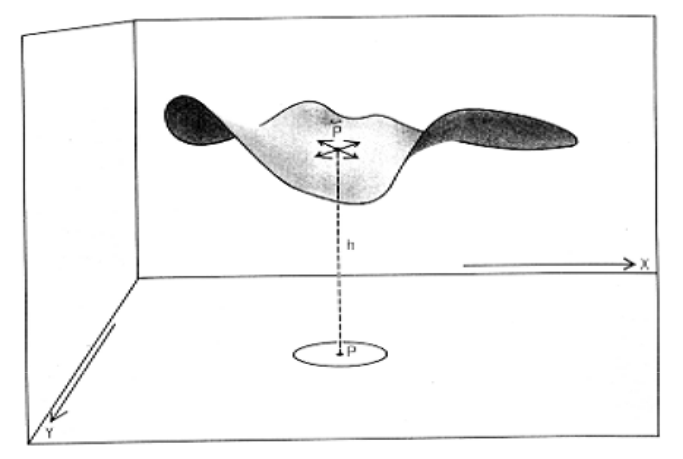
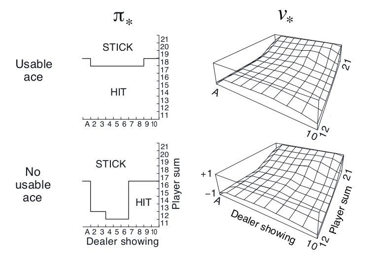
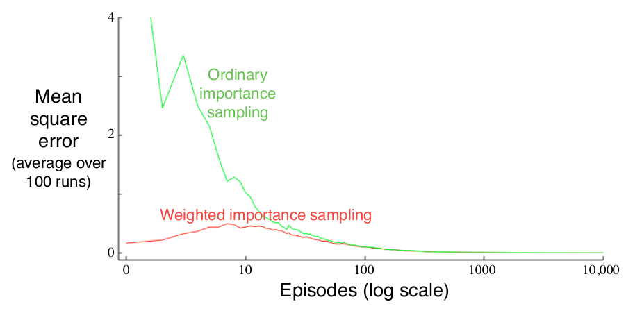
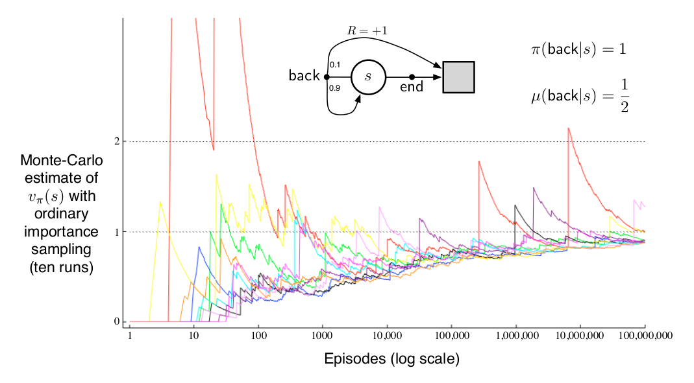

# 第五章  

# 蒙特卡洛方法

  这一章，我们开始考虑评估值函数以及获得最优策略的第一种学习方法。不同于上一章，这里我们不再假设我们对环境有完全的了解。蒙特卡洛方法（Monte Carlo methods）需要的仅仅是*经验（experience）*——与环境进行真实的或者模拟的交互所得到的状态，动作，奖励的样本序列。其中，从*真实*的经验学习是非常吸引人的，因为它在不需要关于环境动态的先验知识的情况下仍然能够获得最优的行为（策略）；而从*模拟*的经验学习也同样强大，虽然这时需要一个模型，但是这个模型仅仅用来产生样本，并不是动态规划（DP）方法中所用到的所有转移概率的完整分布函数。在相当多情况下我们很容易从目标的概率分布函数中进行抽样得到样本，可是很难获得这个分布的显式（具体）形式。[^译者注1]

​		

[^译者注1]: 这里是说，很多情况下我们不知道转移概率的具体分布，所以很难用动态规划的办法。但是我们很容易从与环境交互中获得抽样样本，可以用蒙特卡罗的办法。因为样本是直接从环境中获得的，等效于直接从真实的转移概率分布中抽样。

  蒙特卡罗方法是基于对样本回报（return）求平均的办法来解决强化学习的问题的。为了保证能够得到良好定义的回报，这里我们定义蒙特卡洛方法仅适用于回合制任务（eposodic tasks）。就是说，我们假设我们的经验（experience）被分成一个个的事件，而且对每个事件而言，不管选择什么样的动作，都会结束。只有在事件结束时，我们的价值估计和策略才会改变。蒙特卡洛方法因此能够写成逐个回合（episode）的增量形式。不过不能写成逐步（在线）的形式。术语“蒙特卡洛”被广泛的用于任何的在操作中引入了随机成分的估计方法。这里我们使用它来表示基于平均整个回报（return）的方法（区别于那些使用部分的回报（return）的方法。我们将在下一章阐述）。

  蒙特卡洛方法使用抽样以及对状态-动作对的*回报（return）*求平均的办法很像我们在第二章中遇到的赌博机中使用的方法，在第二章中我们也使用了抽样以及对每个动作的*奖励（reward）*求平均的方法。他们主要的区别在于，我们现在有多种状态，每个表现地就像一个不同的赌博机问题（就像一个联合-搜索或前后关联的赌博机），而且它们之间是相互关联的。就是说，在一个状态下做出一个动作的回报依赖于本事件中这个状态之后的状态所做的动作。因为所有动作的选择也正在学习中，从之前的表述来看，问题变成了非平稳（nonstationary）的。

  为了解决这种非平稳性（nonstationarity），我们改变我们的办法，像我们在第四章中对动态规划方法（DP）所做的，使用广义策略迭代（general policy iteration, GPI）。那里我们依靠对MDP的了解来*计算（computed）*价值函数（value function），这里呢我们从MDP的抽样回报中*学习（learn）*价值函数（value function）。我们使用相同的办法去获得最优的价值函数和策略，即GPI中价值函数和对应的策略交互作用。就像在动态规划（DP）的那章所做的，首先我们考虑yuce（prediction）的问题（计算一个随机策略$\pi$的价值$v_{\pi}$和$q_{\pi}$），然后是策略改进（policy improvment），以及，最后，控制（control）的问题和解决它的办法广义策略迭代（general policy iteration, GPI）。从动态规划（DP）中得到的这些想法都被推广到蒙特卡洛（Monte Carlo）方法中。在这种情况下，我们只有样本经验（sample experience）。

---

## 5.1 蒙特卡洛预测

  我们开始考虑在给定策略的情况下，用蒙特卡罗方法学习状态-价值函数（state-value function）。我们之前讲过，一个状态（state）的价值（value）等于从这个状态开始，它的期望回报（expected return）——期望的累积未来折扣奖励（reward）。一个显而易见的估计方法是，对经验（experience）中的所有的这个状态的回报（return）求平均。随着更多的回报（return）被观察到，这个平均值会收敛于它的期望值，即期望回报（expected return）。这个想法根植于所有的蒙特卡洛方法（Monte Carlo methods）中。

  具体来看，假设我们想要估计$v_{\pi}({s})$的值。这个记号表示遵循策略$\pi$的情况下，状态$s$的价值。我们已经得到了一些回合（episodes），它们都遵循策略$\pi$并且都出现了状态$s$。每当一个回合（episode）中出现状态$s$，我们就说这是对状态$s$的一次*访问（visit）*。当然了，在一个中状态$s$可能被访问（visit）多次。我们称第一次为*首次访问（first visit）*。所以呢我们有两种蒙特卡罗方法（Monte Carlo methods），一种只计算所有回合中首次访问状态$s$的平均回报（return），以此作为$v_\pi(s)$的估计值，我们称之为*first visit MC方法*；与之对应的，另一种方法计算所有回合中每次访问状态$s$的平均回报（return），我们称之为*every visit MC方法*。上述的两种方法很相似，但是具有细微不同的理论特性。第一种方法（指 first-visit MC）被广泛研究可追溯到十九世纪四十年代，所以我们这一章主要关注这种方法。至于第二种方法呢，我们将在第九章和第十二章分别作为函数近似（function approximation）和资格迹（eligibility traces）的扩展。first visit MC方法如下所示。

---

First-visit MC 策略评估（回报$$V \approx v_\pi$$）

> ---
>
> 初始化：
>
> ​	$\pi \leftarrow$ 需要估计的策略
>
> ​	$V \leftarrow$ 随机的价值状态函数
>
> ​	$Returns(s) \leftarrow$ 一个空的列表，对所有 $s \in S$ 
>
> 
>
> 一直循环：
>
> ​	使用$\pi$生成一个回合（episode）
>
> ​	对于回合中的每一个状态$s$：
>
> ​		$G \leftarrow$ $s$首次出现后的回报（return）
>
> ​		将$G$添加到列表$Returns(s)$中
>
> ​		$V(s) \leftarrow average (Returns(s))$
>
> `
>
> ---

  不论是first-visit MC方法还是every-visit MC方法，都会随着访问$s$的次数趋于无穷而收敛于$v_\pi(s)$。对于first-visit MC方法，这是显而易见的。在这种情况下，每个回报都是对于$v_{\pi}(s)$的有限方差的独立同分布的估计。根据大数定理，这些估计的平均数会收敛于期望价值（expectd value）。每个平均是无偏（unbiased）的估计，标准差随着次数减小的关系是$1 / \sqrt{n}$，其中$n$是求平均的量的个数（即是说，估计以二次方的速度收敛）。every-visit的方法则没有那么直观，不过也会二次方的速度收敛于$v_\pi(s)$（Singh and Sutton, 1996）。

  我们用一个例子来很好的说明如何使用蒙特卡洛方法（Monte Carlo method）。

---

**例5.1：二十一点（Blackjack）**	这个风靡于赌场的游戏*二十一点*是一种比谁手上的牌点数和大（不超过21点）的游戏。其中，所有的J，Q，K记为10点，A即可为1也可为11。我们考虑的版本是玩家独立面对庄家。游戏开始时每人手上有两张牌，其中庄家的牌有一张是明牌。如果玩家起手就是21点（一张10点的牌和一张A），这个叫*natural*。这种情况下就算庄家也是natural也判玩家赢，这种情况叫draw，游戏结束。如果玩家起手点数小于21点，那么他可以要牌（hits），每次要一张，或者停止要牌（sticks）。如果玩家的牌超过21点，玩家就直接输了，叫做爆掉（goes bust）。如果玩家停止要牌，那么进入庄家回合，庄家的策略是，只要超过17点就停止，否则就一直要牌。如果庄家爆掉（bust），那么玩家赢。如果大家都没爆掉，那么就比谁的点数接近21点。

  21点可以看成一个回合式的有限马尔科夫过程（episodic finite MDP）。每次游戏都是一个回合（episode）。赢、输、draw的奖励分别为1、-1、0。游戏过程中的任意动作奖励（reward）都为0，我们不算折扣（$\gamma = 1$）；因此这些结束状态的奖励（reward）即是回报（return）。玩家的动作（action）只有要牌（hits）或者停止要牌（sticks）两种。游戏的状态（state）取决于玩家是什么牌以及庄家手上的明牌。我们假设牌数是无限的，这样我们就不能记牌了。如果玩家将A当成11点来算的话（不能爆掉），我们称它*被使用了（usable）*。开始时我们把A当成11，因为如果当成1的话，那么开始时的牌肯定是小于等于11点的，这样我们没有更多的选择，肯定是会要牌（hit）的。所以，玩家做出的决定依赖于三个变量：当前的牌的点数和（12-21）、庄家的明牌的点数（A-10）以及玩家是否有被使用的A。这样的话，总共有200个不同的状态。

  我们考虑这样的策略：一直要牌，直到点数和等于20或21时停止。为了使用蒙特卡洛方法（Monte Carlo method）找到这个策略下的状态价值函数，我们使用一个模拟器模拟了许多次的游戏，游戏中玩家使用上述的策略。然后我们将每个状态的回报值求平均，作为对应状态的价值函数。注意这个任务中，first visit MC和every visit MC是一样的，因为一种状态只能在一个回合（episode）中出现一次。通过这种方法求得的价值函数如图5.1所示。可以看到，如果A被使用（usable），相对于不被使用（no usable），估计的值会有更多不确定性，更加不规则，因为这些状态不是很常见。经过500,000次的游戏，我们看到价值函数被估计得很好。

图5.1：遵循一直要牌直到点数和等于20或21的策略，使用蒙特卡洛策略评估求得的估计的状态价值函数。

  在这个任务中，虽然我们对环境有完全的了解，但是我们仍然难以用动态规划算法（DP）来计算价值函数。动态规划（DP）需要下一个状态的分布——具体讲，它需要转移函数$p(s^{'},r|s,a)$的值——而这在二十一点里不太好确定。例如说，假设玩家的牌面和为14点，并且玩家选择停止要牌（stick）。那么对应庄家的明牌点数，玩家的期望奖励（expected reward）是多少呢？所有这些期望奖励（expected reward）和转移函数$p(s^{'},r|s,a)$都需要在使用动态规划（DP）算法之前得知。而它们的计算量很大且容易出错。相比而言，使用蒙特卡洛方法（Monte Carlo method）仅仅只需要产生样本就好了，这要简单许多。上面所说的情况是非常常见的，蒙特卡洛方法（Monte Carlo method）只需要样本回合，这相比动态规划（DP）需要对动态环境有完全的了解而言有很大的优势。

---

  我们能将备份图表（backup diagrams）的想法推广到蒙特卡洛的算法中吗？这个图表的顶部根节点是我们需要更新的量，树枝和叶节点分别表示这些转移状态的奖励（reward）以及下个状态的估计价值。具体的，对于蒙特卡洛估计，如图5.2所示，根节点是我们的起始状态的价值，之后的轨迹表示一个特定回合的经历，最后以终止状态结束。我们可以通过与动态规划（DP）的图表（图3.4-左）对比发现，首先，动态规划（DP）的图表展示了所有的转移可能，列出了所有可能的下一状态，而蒙特卡洛（MC）在一个回合（episode）里只有一种转移可能。其次，动态规划（DP）只包含了单步的转移状态价值，而蒙特卡洛（MC）表示一个回合从开始到结束的所有状态价值。这些图表所表现的不同精确的反应了这两种算法的根本性的差异。

图5.2： 蒙特卡洛（MC）估计$v_\pi$的备份图表

  需要注意的是，蒙特卡洛（MC）方法对每个状态的估计是独立的，即是说，对这个状态的估计并不取决于其他的状态，这点和动态规划（DP）是一样的。换句话说，就像我们在前面的章节所提到的，蒙特卡洛（MC）方法不使用*bootstrap*。

  特别地，注意到我们估计每一个特定状态的价值（value）所需要花费的计算开销都是独立于状态数量的（因为不使用bootstrap，与其他状态无关）。所以但我们只需要一个或者一小部分状态信息时，蒙特卡洛（MC）方法就很有吸引力了。我们可以从我们关心的那个状态开始，生成很多回合的样本，然后求它们的回报（return）的均值，而不用管其他的起始状态。这是蒙特卡洛（MC）方法继可以从真实经验和模拟经验中学习之后的第三个好处。

---

**例 5.2：肥皂泡** 假设一根线围成一个闭环，在肥皂水中浸泡后，表面形成了一个肥皂薄膜或者泡泡。如果线是不规则的，如何计算肥皂泡泡的形状呢？已知泡泡的形状有一个特性：在表面任一点，受到临近的力之和为零（如果不为零，泡泡的形状会改变，直到稳定下来）。这个性质意味着，泡泡表面上的每一点的高度等于周围点高度的平均值。此外，表面的形状必须符合线形成的边界。解决这个问题的常规办法是，用网格分格这个区域，使用网格上的周围点来计算一点的高度，然后迭代地进行。边界上的点的高度和线上的那点一致，然后其他的点的高度都可以从临近网格的点的高度求平均得到。这个过程不断的迭代，很像动态规划（DP）迭代策略评估（iterative policy evaluation）。最终，这个不断迭代的过程会收敛到很接近真实的表面形状。

线圈上的肥皂泡

  这个问题和蒙特卡洛（MC）所涉及的问题是类似的。除了上述提到的迭代计算的方法，我们还可以想象在表面进行随机漫步。在网格上的每一点以等概率向临近的点移动，直到到达边界。结果是，这些边界点的高度求得的期望值即是我们随机漫步起始点的高度（事实上，它恰好等于之前的迭代方法计算得到的值）。因此，我们能够很好地得到表面上任意一点的高度值。只需要从该点开始，进行许多次随机漫步，然后将所有得到的边界高度值求平均。如果我们仅仅对某一点或者某一小块区域的高度感兴趣，这个蒙特卡洛（MC）方法要比之前的迭代方法高效的多。

---

练习 5.1  

请思考，图5.1右边两幅图：为什么估计值在尾部的最后两行会突然变大？为什么最左边的整个一行价值会有下降？为什么前面部分，上面图中的价值要大于下面的图？

​	

---

## 5.2 对动作价值的蒙特卡洛估计

  如果模型不可用，那么估计*动作（action）*价值（即状态-价值（state-action）对的值）而不是*状态（state）*价值就会特别有用。如果模型可用，那么仅使用状态价值（state value）就可以决定策略。决定下一步只需要看哪个动作导致的累积奖励最多，就像我们在动态规划（DP）那章所讲的一样。而如果模型不可用，仅使用状态价值（state value）是不够的。我们必须清楚地估计每个动作的价值，这样才能联系到策略（policy）。所以，蒙特卡洛方法（MC methods）主要用来估计$q_*$。为此，我们首先考虑对动作价值（action value）的估计问题。

  对于动作价值（action value）的策略评估问题，即估计$q_\pi{(s,a)}$。$q_\pi{(s,a)}$定义为，从状态$s$开始，做出动作$a$，之后遵循策略$\pi$，所得到的期望回报（return）。在这里使用的蒙特卡洛方法（MC methods）与上一节对状态价值（state value）使用的基本相同，只不过现在谈论的是状态-动作对（state-action pair）而不是状态（state）。一个状态-动作对（state-action pair）$s,a$即是说在一个回合里，访问到状态$s$，并做出动作$a$。在every-visit MC方法中，每次访问状态-动作对都会计算，最后求平均；而first-visit MC方法每个回合只计算最多一次。当访问次数趋近于无穷时，这两种方法（指every-visit MC 和first-visit MC）都会以二次方收敛到期望值。

  唯一的问题是，可能会有许多状态-动作对（state-action pairs）从未被访问到。如果$\pi$是一个确定性的策略（deterministic policy），那么遵循策略$\pi$，每个状态将会仅仅观察到一个动作的回报（return）。如果不能观察到其他动作的回报（return），也就不能求平均，那么蒙特卡洛的估计就不能随着经验的增加而提高。这是一个严重的问题，因为我们学习动作价值，就是为了在每个状态选择合适的动作。为了比较所有的可能，我们需要估计每个状态*所有*可能的动作，而不仅仅是当前选择的动作。

  这是一个很普遍的问题，即*保持探索（maintaining exploration）*。我们在第二章的k-臂赌博机问题中提到过。要使策略评估能够工作，我们必须保证持续的探索。一个办法是，*从特定的状态动作对出发*，对每种动作都有大于零的概率选择到。这能够保证经历无限个回合后，所有的状态-动作对（state-action pair）都会被访问到无限次。我们称这种假设为*探索开端（exploring starts）*。

  这个探索开端的假设有时是很有用的。但是它不具普遍意义，特别是当我们直接从与真实环境的交互中学习时，这种方法就不太适用了。在这种情况下（指从与真实环境的交互中学习）起始状态不是很有用。为了让所有状态-动作对（state-action pair）都能访问到的更加普遍的一种方法是，让我们的策略是随机策略，即每个状态下，选择任意动作的概率都不为零。我们将会在后面的小节里讨论这种方法的两个变种。现在，我们假设是探索开端，然后完整地表述蒙特卡洛控制方法（Monte Carlo control method）。

---

练习 5.2

请问蒙特卡洛估计$q_\pi$的备份图表怎样的？

---

## 5.3 蒙特卡洛控制

  现在，我们开始考虑蒙特卡洛估计来解决控制问题，即是说，求解近似最优的策略。整个的过程和上一章动态规划的模式相同，我们依照广义策略迭代（GPI）的思想。广义策略迭代（GPI）中，我们同时维持一个近似的策略和一个近似的价值函数。这个价值函数会不断地靠近当前策略的价值，而这个策略也会不断地根据当前的价值进行提升，如下图所示。

这两种变化在一定程度上相互作用，任意一方的改变都会引起另一方的改变，但是总的来讲他们使策略和价值函数都趋向于最优。

  首先，我们考虑经典的策略迭代的蒙特卡洛（MC）版本。这里，我们交替执行策略迭代和策略提升的完整步骤。从一个随机的策略$\pi_0$开始，以最优策略和最优的动作-价值函数结束：

$$
\pi_0 \overset{E}{\rightarrow} q_{\pi_0} \overset{I}{\rightarrow} \pi_1 \overset{E}{\rightarrow} q_{\pi_1} \overset{I}{\rightarrow} \pi_2 \overset{E}{\rightarrow} \cdots \overset{I}{\rightarrow} \pi_{*} \overset{E}{\rightarrow} q_{*}
$$
其中，$\overset{E}{\rightarrow}$表示一个完整的策略评估，$\overset{I}{\rightarrow}$表示一个完整的策略提升。策略评估的做法上一节已经说明。随着我们经历越来越多的回合，近似的动作-价值函数渐进地趋近于真实的动作-价值函数。此时，我们假设观察到了无限的回合，而且这些回合都是以探索开端（exploring starts）的方式生成的。在上述假设下，蒙特卡洛方法会精确地计算每个$q_{\pi_k}$，对应于随机策略$\pi_k$。

  策略提升的方法是，对于当前的价值函数，使策略贪婪（greedy）。这种情况下，我们有*动作-价值（action-value）*函数，因此不需要模型来构建贪婪策略。对于任何的动作-价值（action-value）函数$q$，它对应的贪婪策略是：对每个$s \in S$，选择使动作-价值（action-value）函数最大的那个动作：

$$
\pi(s) \dot{=} arg \space \underset{a}{max} \space q(s,a)
\tag{5.1}
$$
之后我们可以做策略提升，我们构建每个$\pi_{k+1}$为$q_{\pi_k}$的贪婪策略。策略提升理论（见4.2节）可以应用到$\pi_k$和$\pi_{k+1}$上，因为对于所有$s \in S$，

$$
\begin{eqnarray}
q_{\pi_k}(s, \pi{k+1}(s)) &=& q_{\pi_k}(s, arg \space \underset{a}{max} \space q_{\pi_k}(s))\\
 &= &\underset{a}{max} \space q_{\pi_k}(s, a)\\
 &\geq& q_{\pi_k}(s, \pi_k(s))\\
 &\geq& v_{\pi_k}(s).\\
 \end{eqnarray}
$$
正如我们上一章说阐述的，这个理论保证了每个$\pi_{k+1}$都一致地比$\pi_k$好，或者和$\pi_k$一样好。后者，我们能得到两个最优策略。这个理论保证了整个过程会收敛到最优的策略和价值函数。通过这种方法我们能在不知道环境动态（不知道转移函数）的情况下，仅靠样本回合（使用蒙特卡洛（MC）方法）来找到最优策略。

  我们做出了两个不太可能的假设，以保证蒙特卡洛（MC）方法能够收敛。第一个是，回合都是探索开端（exploring starts）的方式；第二个是，我们有无限个回合供策略评估使用。为了得到一个可实践的算法，我们将不得不删除这两个假设。我们将在这一章的稍后部分考虑怎么删除第一个假设。

  现在，我们先考虑第二个假设，即策略评估需要无限的回合。这个假设相对容易去掉。事实上，相同的问题曾在上一章的经典动态规划（DP）算法中出现过。例如迭代策略评估（iterative policy evaluation）只会渐进地收敛到真实价值函数。无论是DP还是MC，我们有两种方法解决这个问题。一个方法是，让每次策略评估都足够接近$q_{\pi_k}$。为了获得这个估计的边界的量级和错误的概率，我们会使用一些方法和一些假设，然后经过足够多的步骤后，策略评估能够保证这些界（bound）足够的小。这个方法可以完全满足保证收敛到一定程度的近似。然而，如果使用这种方法，即使是解决最小的问题，在实践中也会需要非常多的回合。

  第二种办法是（避免策略评估需要无限回合），在跳转到策略提升前，尝试去完成策略评估。评估的每一步，我们将价值函数向$q_{\pi_k}$移动，但是我们不用移动到期望的值。我们最先在4.6节的GPI中介绍了这种方法。一个极端的例子是价值迭代（value iteration），就是每执行一步策略提升就要执行一步策略评估。还有一种更极端的例子是价值迭代的原地（in-place）版本，它每个状态交替使用策略提升和策略评估。

  对于蒙特卡洛策略评估而言，以回合制的方式交替使用策略评估和策略提升是很自然的。每一个回合结束后，观察到的回报（return）用来做策略评估，然后对每个经历的状态做策略提升。完整的简化算法在下面的盒子中，我们称作探索开端的蒙特卡洛算法（Monte Carlo ES, Monte Carlo with Exploring Starts）。

  在MC-ES算法里，每个状态-动作对的回报会累积起来并求平均，不管使用的是什么策略。很容易看出，这个算法不会收敛到次优的策略。因为，如果收敛到次优的策略，由于价值函数最终会收敛到该策略对应的价值，这又可以做策略提升了。只有当策略和价值函数均为最优时才会稳定。收敛到最优的那点看起来是不可避免的，因为动作-价值函数的改变越来越小。不过这个还未被正式的证明。在我们看来，这个是强化学习中最为重要的开放问题（部分解决方法，看Tsitsiklis，2002）。

---

探索开端的蒙特卡洛算法（Monte Carlo ES）

---

初始化，对所有的$s \in S, a \in A(s)$:

​	$Q(s,a) \leftarrow $ 随机数

​	$\pi(s) \leftarrow$ 随机数

​	$Returns(s,a) \leftarrow$ 空表

一直循环：

​	选择状态$S_0 \in S$和动作$A_0 \in A(S_0)$，所有状态-动作对的概率大于0

​	从$S_0, A_0$开始，遵循策略$\pi$，生成一个回合

​	对于这个回合中的每个出现的$s, a$对：

​		$G \leftarrow $ $s, a$对的回报（只计算首次出现的$s, a$对）

​		将$G$添加到$Returns(s, a)$里

​		$Q(s, a) \leftarrow average(Returns(s ,a))$

​	对于这个回合里的每个状态$s$：

​		$\pi(s) \leftarrow arg \space \underset{a}{max} \space Q(s, a)$

---

图 5.3： 使用探索开端的蒙特卡洛算法（Monte Carlo ES），21点的最优策略和状态-价值函数。状态-价值函数是从算法得到的动作-价值函数计算而来的

---

**例 5.3： 解决21点问题**  我们很容易的使用探索开端的蒙特卡洛算法来解决这个问题。由于这些回合都是仿真的游戏，所以很容易使探索开端包含所有的可能性。这种情况下，我们只需要庄家的牌，玩家的牌面和，以及玩家是否有使用的A的值都以等概率提取。初始策略使用我们之前讨论时使用的，即在20或21时停止要牌，其余情况均要牌。初始的各个状态的动作-价值函数均为零。图5.3展示了使用Monte Carlo ES算法得到的最优策略。这个策略除了使用A的策略中左边的缺口外，和Thorp在1966提出的“基本”策略是一样的。Thorp的策略没有那个缺口。我们虽然不清楚为什么会有那个缺口，但是我们确信上图的策略就是我们所说版本的21点游戏的最优策略。

---

## 5.4 非探索开端的蒙特卡洛控制

  如何摆脱这个在实践中不太可能发生的探索开端的假设呢？保证无限次后所有的动作都能被选到的惟一的通用办法是让智能体能够持续地选择它们。具体来讲有两种方法，我们称之为*在策略（on-policy）*方法和*离策略（off-policy）*方法。在策略方法尝试去估计和提升我们用作决策的那个策略；而离策略估计和提升的策略与用来生成数据的策略不同。我们上一节所用到的Monte Carlo ES方法就是一种在策略方法。在这一节里，我们还将学习如何设计不用探索开端假设的在策略蒙特卡洛控制（on-policy Monte Carlo control）算法。离策略方法将在下一节说明。

  我们的在策略控制方法是*软的（soft）*，即是说所有的$s \in S$和$a \in A(s)$，$\pi(a|s) > 0$，但是会逐渐地接近于确定性的最优策略。许多第二章谈论的方法都可以提供这种机制。这一节我们使用*$\epsilon -$贪心（$\epsilon - greedy$）*策略，即大多数时间选择有最大的动作价值的动作，但是有$\epsilon$的概率选择随机的动作。也就是说，对所有非贪心的动作，选择它的概率是$\frac{\epsilon}{|A(s)|}$，选择贪心的动作的概率是$1 - \epsilon + \frac{\epsilon}{|A(s)|}$。$\epsilon -$贪心是$\epsilon - soft$策略的一个例子，在$\epsilon - soft$中，对所有的状态和动作，有$\pi(a|s) \geq \frac{\epsilon}{|A(s)|}$。在$\epsilon - soft$中，$\epsilon -$贪心策略是最接近贪心的。

  在策略蒙特卡洛控制的思想仍然是广义策略迭代（GPI）。和Monte Carlo ES一样，我们使用first-visit蒙特卡洛方法来估计当前策略的动作-价值函数。由于没有探索开端这个假设，我们不能简单地对当前价值函数使用贪心，来提升当前的策略，因为那样会影响我们在未来对非贪心动作的探索。幸运的是，广义策略迭代（GPI）并不需要我们的策略一直保持贪心，只是要求不断向贪心策略*靠近（toward）*。我们的在策略方法会不断的趋向于贪心策略。对任意的$\epsilon - soft$策略$\pi$，$q_\pi$对应的任意的$\epsilon - $贪心策略都不坏于策略$\pi$。完整的算法如下。

---

在策略first-visit蒙特卡洛控制（对于$\epsilon - soft$策略）

---

初始化，对所有的$s \in S, a \in A(s)$：

​	$Q(s,a) \leftarrow $ 随机值

​	$Returns(s,a) \leftarrow$ 空表

​	$\pi(a|s) \leftarrow$ 一个随机的$\epsilon - soft$策略

一直循环：

​	（a）使用策略$\pi$生成一个回合

​	（b）对回合中出现的每个$s,a$对：

​			$G \leftarrow$ 回报（遵循$s,a$对的首次出现原则）

​			将$G$添加到表$Returns(s,a)$中

​			$Q(s, a) \leftarrow average(Returns(s ,a))$

​	（c）对回合中的每个$s$：

​			$A^* \leftarrow arg \space \underset{a}{max} \space Q(s,a)$

​			对所有的$a \in A(s)$：

$$
\pi(a|s) \leftarrow \left\{
\begin{array}{rcl}
1 - \epsilon + \frac{\epsilon}{|A(s)|} & & if &a=A^* \\
\frac{\epsilon}{|A(s)|} & & if &a \neq A^*
\end{array}
\right.
$$

---

  由于策略提升理论的保证，$q_\pi$对应的任意的$\epsilon - $贪心策略都较$\epsilon - soft$策略$\pi$有所提高。设$\pi'$为$\epsilon - $贪心策略。策略提升理论能够应用在这里，因为对所有$s \in S$:
$$
\begin{eqnarray}
q_\pi{(s, \pi^{'}(s))} &=& \sum_a \pi^{'}(a|s)q_\pi{(s,a)}\\
&=& \frac{\epsilon}{|A(s)|}\sum_a q_\pi{(s,a)} + (1-\epsilon)\space  \underset{a}{max}\space q_\pi{(s,a)}\tag{5.2}\\
&\geq& \frac{\epsilon}{|A(s)|}\sum_a q_\pi{(s,a)} + (1-\epsilon)\sum_a \frac{\pi(a|s)-\frac{\epsilon}{|A(s)|}}{1-\epsilon}q_\pi(s,a) \\
\end{eqnarray}
$$
（和为1的非负权值的加权平均，所以它必须小于等于最大数的求和）
$$
\begin{eqnarray}
&=& \frac{\epsilon}{|A(s)|}\sum_a q_\pi{(s,a)} - \frac{\epsilon}{|A(s)|}\sum_a q_\pi{(s,a)} + \sum_a \pi(a|s)q_\pi{(s,a)}\\
&=&v_\pi{(s)}.\\
\end{eqnarray}
$$
所以，由策略提升理论，$\pi^{'} \geq \pi \space(i.e., v_\pi{'}{(s)} \geq v_\pi{(s)}, 对所有s \in S)$。我们现在证明等号只能在$\pi^{'}$和$\pi$均为最优策略时才能取到，即它们比任何其他$\epsilon - soft$策略要好。

  考虑一个除了策略是$\epsilon - soft$移动到环境内部，其他和原来环境恰好相同的新环境。这个新环境有相同的状态和动作集，行为也和之前一样。如果在状态$s$，做出动作$a$，那么有$1 - \epsilon$的可能性新环境和旧环境表现一样，有$\epsilon$的可能性会随机的以等可能性在所有动作里重新选择一个动作，再次重复之前的动作（即对于这个新的动作，有$1-\epsilon$可能性与旧环境一样，$\epsilon$可能性重新随机选动作）。在新环境中能够做的最好的情况与旧环境相同。让$\tilde{v}_*$和$\tilde{q}_*$表示新环境的最优的价值函数。策略$\pi$是最优的，当且仅当$v_\pi = \tilde{v}_*$。从$\tilde{v}_*$的定义我们知道它是下式的唯一解
$$
\begin{eqnarray}
\tilde{v}_*(s)  &=& (1-\epsilon) \space \underset{a}{max} \space \tilde{q}_*(s,a) + 
\frac{\epsilon}{|A(s)|}\sum_a \tilde{q}_*(s,a)\\
&=& (1-\epsilon) \space \underset{a}{max} \space \sum_{s^{'}, r} p(s^{'},r|s,a)[r+\gamma\tilde{v}_*(s^{'})] \\ 
& & + \frac{\epsilon}{|A(s)|}\sum_a \sum_{s^{'}, r} p(s^{'},r|s,a)[r+\gamma\tilde{v}_*(s^{'})]
\end{eqnarray}
$$
当$\epsilon - soft$策略$\pi$没有提升时，取等号。我们还知道，由（5.2）式，
$$
\begin{eqnarray}
v_\pi(s) &=& (1-\epsilon) \space \underset{a}{max} \space q_\pi(s,a) + 
\frac{\epsilon}{|A(s)|}\sum_a q_\pi(s,a)\\
&=& (1-\epsilon) \space \underset{a}{max} \space \sum_{s^{'}, r} p(s^{'},r|s,a)[r+\gamma v_\pi(s^{'})] \\ 
& & + \frac{\epsilon}{|A(s)|}\sum_a \sum_{s^{'}, r} p(s^{'},r|s,a)[r+\gamma v_\pi(s^{'})]
\end{eqnarray}
$$
这个方程与上面的方程相比，除了把$\tilde{v}_*$换成了$v_\pi$，其他的都相同。由于$\tilde{v}_*$是唯一的，所以必须是$v_\pi = \tilde{v}_*$。

  其实，我们在前几页已经说明了策略迭代适用于$\epsilon - soft$策略。对$\epsilon - soft$策略使用贪心策略，我们能够保证每一步都有提升，直到我们找到最优的策略为止。虽然这个分析独立于动作-价值函数的确定，但是它假设策略和价值都能精确计算。这使我们上一节大概相同。现在我们只通过$\epsilon - soft$策略得到最优策略，但是另一方面，我们移除了探索开端（exploring starts）的假设。

​	

---

## 5.5 通过重要性采样的离策略预测

  所有的控制方法都会面临这样一个两难的问题：一方面，他们需要通过*最优（optimal）*的行为（behavior）来学习动作价值；但另一方面，他们需要表现地不那么好，来探索所有的动作（来*找到（find）*最优的动作）。那么，如何既能够学到最优策略，又能够在实际中多探索呢？上一节的在策略方法实际上是一个妥协——它学习的并非最优策略，而是仍然保留了探索的近似-最优策略。一个更直截了当的方法是，使用两个策略，一个策略用来学习最优策略，另一个则更具探索性的用来产生行为。用来学习的策略我们称之为*目标策略（target policy）*，另一个用来生成行为的称作*行为策略（behavior policy）*。这种情况下，我们说从数据中学习是“离开了（off）”目标策略的，整个过程用术语*离策略学习（off-policy learning）*表示。

  我们会在本书整个余下的内容中同时探讨在策略和离策略两种方法。在策略方法一般来讲更简单一些，所以一般先考虑它。离策略方法需要额外的概念和记号，且因为数据是由另一个不同的策略产生的，离策略方法通常拥有更大的方差，收敛地更慢。但另一方面，离策略方法更加强大且更一般化。更一般化是因为在策略可以看成是离策略的一种特殊情况，这时两个策略（行为策略和目标策略）一样。又例如，离策略能够从非传统学习器中，或人类专家生成的数据中学习。离策略学习还被看成是学习多步预测模型（multi-step predictive models）的关键，该模型常被用来预测现实世界的动态（Sutton, 2009, Sutton et al., 2011）。

  这一节我们开始学习离策略方法。从考虑*预测（prediction）*问题开始，而且先考虑目标策略和行为策略都是固定的。现在，假设我们想要估计$v_\pi$或者$q_\pi$，但我们所有的回合都由另一个策略$\mu$所得到，这里$\mu \neq \pi$。这种情况下，$\pi$是目标策略，$\mu$是行为策略，这两种策略都认为是已知且固定的。

  为了使用策略$\mu$得到的回合来估计$\pi$的价值，我们需要在策略$\pi$下做出的动作也能时不时的在$\mu$下做出。就是说，我们需要$\pi(a|s) > 0$意味着$\mu(a|s) >0$。这个称为*覆盖（coverage）*假设。对特定的状态$\mu$必须是随机的且不等于$\pi$。另一方面，目标策略$\pi$可以是确定性的，事实上，这在控制问题上会很有趣。在控制问题中，目标策略一般对当前的动作价值函数是确定性的贪心策略。这个策略变成确定性的最优策略的同时，行为策略还能保持随机性和更多的探索性，比如，一个$\epsilon -$贪心策略。当然，这一节，我们只考虑预测问题，且策略是给定的和固定的。

  几乎所有的离策略方法使用了*重要性采样（importance sampling）*。这是一个通用的技术，用来估计随机变量在一个分布上的期望值，但是采样的样本来自另一个分布。我们在离策略上应用重要性采样的方法是，根据目标和行为策略下得到发生的事件轨迹的概率，将得到的回报加权。两个概率的比值称为*重要性采样率（importance-sampling ratio）*。给定初始状态$S_t$，那么在策略$\pi$下，接下来的状态动作轨迹$A_t, S_{t+1}, A_{t+1},...,S_T$发生的概率是
$$
\prod_{k=t}^{T-1} \pi(A_k|S_k)p(S_{k+1}|S_k,A_k),
$$
其中，$p$是状态转移概率函数，它的定义参见式（3.8）。因此，在目标策略和行为策略下的该轨迹的发生的相对概率为（即重要性采样率）
$$
\rho_t^{T} \doteq \frac{\prod_{k=t}^{T-1} \pi(A_k|S_k)p(S_{k+1}|S_k,A_k)}
{\prod_{k=t}^{T-1} \mu(A_k|S_k)p(S_{k+1}|S_k,A_k)}
= \prod_{k=t}^{T-1} \frac{\pi(A_k|S_k)}{\mu(A_k|S_k)}
 \tag {5.3}
$$
注意到上式中的轨迹的概率依赖于MDP的转移概率（常常是未知的），但是我们考虑比率时，它们能够被消掉。即是说，重要性采样率最终仅仅依赖于两个策略，而与MDP无关。

  现在我们准备好给出蒙特卡洛算法，算法使用在策略$\mu$下的一批观察到的回合来估计$v_\pi{(s)}$。为了方便，我们将时间步调设置为穿过回合的递增形式，即下一个回合开始时的时间步调不清零，而是接着上个回合的末尾加一。比如，这一批的回合中，第一回合在时间$100$的时候结束，那么下一个回合在时间$t=101$开始。这使得我们能用时间步调时不用再分特定的回合。特别地，我们可以定义一个集合表示状态$s$被访问到的时间，记为$\cal J(s)$。这时对于every-visit而言的。对于first-visit， $\cal J(s)$只包含第一次访问$s$的时间。然后，$T(t)$表示第一次回合结束的时间，$G_t$表示到$T(t)$的回报。然后集合$\lbrace G_t \rbrace_{t \in \cal J(s)}$表示状态$s$的所有回报，$\lbrace \rho_{t}^{T(t)} \rbrace_{t \in \cal J(s)}$表示对应的重要性采样率。为了估计$v_\pi(s)$，我们用重要性采样率来缩放回报，然后求平均：
$$
V(s) \doteq \frac{\sum_{t \in \cal J(s)} \rho_t^{T(t)} G_t}{|\cal J(s)|}.
\tag{5.4}
$$
当重要性采样只是以上面的简单求平均的方式，我们称为*原始重要性采样（ordinary importance sampling）*。

  另一个选择是*加权重要性采样（weighted importance sampling）*，它使用了加权平均，定义为
$$
V(s) \doteq \frac{\sum_{t \in \cal J(s)} \rho_t^{T(t)} G_t}{\sum_{t \in \cal J(s)} \rho_t^{T(t)}},
\tag{5.5}
$$
假设分母为零，加权重要性采样也为零。为了了解这两种不同的重要性采样方法，我们考虑只有一个回报的情况。对加权重要性采样来说，分子分母中的$\rho_t^{T(t)}$可以消掉，因此这时它就等于我们观察到的回报$G_t$，与重要性采样率无关（假设重要性采样率不为零）。由于只有一个回报被观察到，所以这是一个合理的估计。但是，它的期望值应该是$v_\mu(s)$而不是$v_\pi(s)$。从统计意义上看，这是有偏估计。与之相对，式（5.4）的期望值始终是$v_\pi(s)$（这是无偏的）。但，虽然式（5.4）的的期望是无偏的，它的估计值可能会很大。假设重要性采样率为$10$，即对观察到的轨迹，目标策略发生的可能性是行为策略的$10$倍。这种情况下，采用原始重要性采样方法的估计值是观察到的回报的*$10$倍*。它可能与观察到的回报相差太大了，即使当前的轨迹可以很好的表示目标策略。

  正式地讲，两种重要性采样的不同可以用偏差和方差来表示。原始重要性采样的估计是无偏的，而加权重要性采样是有偏的（偏差会渐进地趋于零）。另一方面，原始重要性采样的方差一般是无界的，因为它的重要性采样率是无界的；而加权重要性采样的最大单个回报是1。事实上，假设回报是有界的，即使重要性采样率为无限，加权重要性采样的方差也是趋于零的（Precup, Sutton, and Dasgupta 2001）。实践中，由于加权重要性采样方差更小，一般更偏向于使用它。然而，我们不能完全放弃原始重要性采样，因为使用函数近似（function approximation），它更容易扩展到近似的方法（approximate methods）。我们将在本书的第二部分介绍近似方法。

  完整的使用加权重要性采样的离策略every-visit MC算法将在将在下一小节给出。

---

**例 5.4： 离策略估计21点的状态价值**

我们应用两种重要性采样方法来用离策略的数据估计单个21点状态的价值。前面讲过，蒙特卡洛方法的一个优势是它可以用来估计单一的一个状态，不用生成其他状态的估计。这个例子中，我们估计当庄家是两点，玩家点数和是13点，玩家有一个使用的A（即玩家有A和2两张牌）。从这个状态生成数据，然后选择要牌或停止是相同的概率（行为策略）。目标策略是只有当点数和为20或21时才停止，如例5.1所示。

图 5.4：从离策略回合数据估计21点的单个状态的价值，加权重要性采样有更低的估计误差。

目标策略的价值大概是$-0.27726$（这是由目标策略生成一百万个回合的回报求平均而得）。两种离策略方法在$1000$个随机的离策略回合后，估计的价值很接近这个值了。为使我们的结果更可信，我们独立的进行了$100$次实验，每次估计值都从零开始，学习$10000$个回合。图5.4显示了学习曲线——两种方法各自的均方误差是回合数的函数，结果是$100$次实验的平均。两种算法的误差都趋向于零，但是加权重要性采样在开始的时候误差更小，这在实践中很典型。

---

**例 5.5：无限方差**

对原始重要性采样的估计通常会有无限的方差，因此带来了不太让人满意的收敛特性，即无论合适，缩放的回报都有无限的方差——而这在回合的轨迹中包含环时更加容易发生。一个简单的例子如图5.5所示。这里只有一个非结束状态$s$和两个动作，**结束**和**返回**。**结束**动作会百分百导致回合结束，而**返回**动作会有$0.9$的可能返回状态$s$，有$0.1$的可能到结束状态。返回动作导致结束的话，有$+1$的奖励；返回状态$s$的话，奖励为零。考虑目标策略是一直选择**返回**的动作。所有的回合都包含了数次（可能是零次）返回状态$s$，然后到结束，并获得奖励。回合的回报为$+1$。因此，在目标策略下，状态$s$的价值是$1$。假设我们使用行为策略生成的离策略数据来估计这个状态的价值，该行为策略选择以等概率随机地选择两种动作。

图 5.5：原始重要性采样估计例5.5的单状态MDP，产生了惊人的不稳定性。正确的估计值应该是1，即使只有一次回报。但图中样本的方差是无限的，估计值不能收敛于这个正确值。这些结果对应于离策略first-visit MC方法。

  图5.5的下部显示了使用原始重要性采样，十次独立的first-visit MC方法得到的结果。即使是经历了数百万次的回合后，估计值也不能收敛到正确值$1$。相反，对加权重要性采样算法来讲，它会在第一个以**返回**动作结束的回合后，就给出刚好为$1$的估计值。所有返回不为$1$的话（以**结束**动作结束），就会造成与目标策略不一致。这时$\rho_t^{T(t)}$为零，影响5.5式的值。这样，加权重要性采样产生的加权平均值，仅考虑了与目标策略相同的回报，因此这个值恰好为$1$。

  我们可以用一个简单的计算证明，对于这个例子中经过重要性采样缩放的回报值，它的方差是无限的。对于随机变量$X$，它的的方差等于它与它的平均值之差的平方的期望值，写作
$$
Var[X] \doteq \mathbb E[(X- \overline{X})^2] = \mathbb E[X^2 - 2X\overline{X^2}]
= \mathbb E[X^2] - \overline{X^2}.
$$
因此，正如我们这种情况，均值是有限的，当且仅当随机变量$X$的平方的期望为无限时，方差为无限。因此，我们只需要说明经过重要性采样缩放的回报的平方的期望是无限的即可：
$$
\mathbb E\left[
\left(
\prod_{t=0}^{T-1} \frac{\pi(A_t|S_t)}{\mu(A_t|S_t)}G_0
\right)^2
\right].
$$
为计算这个期望值，我们基于回合的长度和怎样结束的，将其分成几种情况。首先，我们需要注意的是，对于所有以**结束**动作结束的回合，重要性采样率为零，因为，目标策略永远也不会做这个动作；这些回合对所求的期望值没有任何贡献（圆括号里的值为零），可以忽略。我们只需考虑那些包含一定数量（可能是零）的**返回**动作，然后接着一个**返回**动作导致结束的回合。所有这些回合的回报为$1$，所以$G_0$可以忽略掉。这样，为了得到期望值，我们只需考虑回合的长度，乘以回合发生的可能性，除以重要性采样率的平方，再把他们都加起来：
$$
\begin{eqnarray}
&=& \frac{1}{2}\cdot 0.1\left(\frac{1}{0.5} \right)^2 \tag{长度为1的回合}\\
&&+ \frac{1}{2} \cdot 0.9 \cdot \frac{1}{2} \cdot 0.1\left(\frac{1}{0.5} \frac{1}{0.5} \right)^2 \tag{长度为2的回合}\\
&&+ \frac{1}{2} \cdot 0.9 \cdot \frac{1}{2} \cdot 0.9 \cdot \frac{1}{2} \cdot 0.1\left(\frac{1}{0.5} \frac{1}{0.5} \frac{1}{0.5} \right)^2 \tag{长度为3的回合}\\
&&+ \cdots \\
&=& 0.1 \sum_{k=0}^{\infty}0.9^k \cdot 2^k \cdot 2 \\
&=& 0.2 \sum_{k=0}^{\infty}1.8^k \\
&=& \infty
\end{eqnarray}
$$

---

练习 5.3

给定策略$\mu$的回报，式5.5中$V(s)$换成$Q(s,a)$的表达式是什么？

练习 5.4

对原始重要性采样方法而言，像图5.4那样，学习曲线中误差是随着训练次数的增加而减少的。但是，对加权重要性采样，误差是先增加然后减少，你如何看待这种现象？

练习 5.5

例5.5的结果及其展示图5.5中，我们使用了first-visit MC方法。假设对同样的问题，我们使用every-visit MC方法。估计值的方差还会是无限吗？为什么？

---

## 5.6 增量式的实现

  蒙特卡洛预测方法可以用增量式的方式，用回合式的形式，使用在第二章（2.3节）提到的展开的技术实现。不同的是，第二章中我们平均*奖励*，而蒙特卡洛方法中，我们平均*回报*。其他第二章所用到的，都可以用在*在策略*蒙特卡洛方法中。对于*离策略*蒙特卡洛方法，我们需要分别考虑*原始*重要性采样和*加权*重要性采样两种情况。

  对于原始重要性采样，回报值会被重要性采样率$\rho_t^{T(t)}$所缩放（式5.3），然后再求平均。对于这些方法，我们可以再次使用第二章用到的增量式的方法，即使用缩放的回报值代替第二章所用的奖励值。现在，就剩下*加权*重要性采样的离策略方法。这里，我们需要生成对回报值的加权平均，所以需要一个稍有不同的增量式算法。

  假设我们有一系列的回报值$G_1,G_2,...,G_{n-1}$，都是从相同的状态开始的，且每个回报值对应一个随机的权值$W_i (e.g., W_i = \rho_t^{T(t)})$。我们希望表示估计值
$$
V_n \doteq \frac{\sum_{k=1}^{n-1}W_k G_k}{\sum_{k=1}^{n-1}W_k}, \quad n \geq 2,\tag{5.6}
$$
然后每获得一个额外的回报$G_n$，保持更新。除了跟踪$V_n$，我们还必须保持，给定前$n$个回报，每个状态的累积权值$C_n$。$V_n$的更新规则是
$$
V_{n+1} \doteq V_n +\frac{W_n}{C_n}\left[G_n - V_n \right], \quad n \geq 1,\tag{5.7}
$$
且
$$
C_{n+1} \doteq C_n + W_{n+1},
$$

---

增量式的离策略every-visit MC 策略评估

---

初始化，对所有$s \in \mathcal S, a \in  \mathcal A(s)$：

​	$Q(s,a) \leftarrow$ 随机值

​	$C(s,a) \leftarrow 0$

​	$\mu(a|s) \leftarrow$ 随机的软的行为策略

​	$\pi(a|s) \leftarrow$ 随机的目标策略

一直循环：

​	使用策略$\mu$生成回合：

​		$S_0, A_0, R_1,...,S_{T-1},A_{T-1}, R_T, S_T$

​	$G \leftarrow 0$

​	$W \leftarrow 1$

​	$for \quad t= T-1, T-2,... 0$：

​		$G \leftarrow \gamma G + R_{t+1}$

​		$C(S_t,A_t) \leftarrow C(S_t,A_t) +W$

​		$Q(S_t,A_t) \leftarrow Q(S_t,A_t) + \frac{W}{C(S_t,A_t)}[G - Q(S_t,A_t)]$

​		$W \leftarrow W \frac{\pi(A_t|S_t)}{\mu(A_t|S_t)}$

​		如果$W=0$， 退出$for$循环

---

这里$C_0 \doteq 0$（且$V_1$是随机的因此需要一个具体值）。上面的框中包含了完整的回合式的增量式算法，用于蒙特卡洛策略估计。这个算法主要用在离策略的情况，使用加权重要性采样，但是也能用于在策略的情况。用于在策略时，让目标策略和行为策略一样即可（这种情况下（$\pi = \mu$），$W$始终是1）。近似值$Q$收敛到$q_\pi$（对所有的出现的状态-动作对），而动作由另一个潜在的不同策略$\mu$提供。

---

练习 5.6

修改5.1节中first-visit MC策略评估算法，对样本求平均时使用2.3节提到的增量式的实现。

练习 5.7

从5.6式推导出5.7式的加权平均更新规则。遵循2.3节的非加权的规则。

---

## 5.7 离策略控制

  现在

---

## *5.8 具体返回的重要性采样

---

## 5.9 小结

---

 

